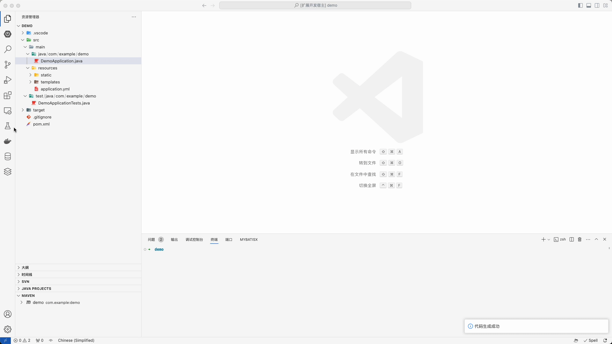

# database-client-code-generate README

[DataBase Client 插件代码生成器](https://marketplace.visualstudio.com/items?itemName=cweijan.vscode-database-client2)

## Features

- One Key Generate Java Code

## Requirements

- Java Project(Current)
- [spring-ex](https://github.com/Guan-Meng-Yuan/spring-ex)

## Extension Settings

Include if your extension adds any VS Code settings through the `contributes.configuration` extension point.

For example:

This extension contributes the following settings:

- `database-client-code-generate.javaRootPackage`: JavaRootPackagePath `example: com.example.demo`
  - required
- `database-client-code-generate.javaDomainPackage`: domain package name
  - default: `model.domain`
- `database-client-code-generate.javaControllerPackage`: controller package name
  - default: `controller`
- `database-client-code-generate.javaServiceInterfacePackage`: service interface package name
  - default: `api`
- `database-client-code-generate.javaServiceImplPackage`: service impl package name
  - default: `service`
- `database-client-code-generate.javaMapperPackage`: mapper package name
  - default: `mapper`

## Release Notes

### 0.0.1

Initial release of generate

---

**Enjoy!**
